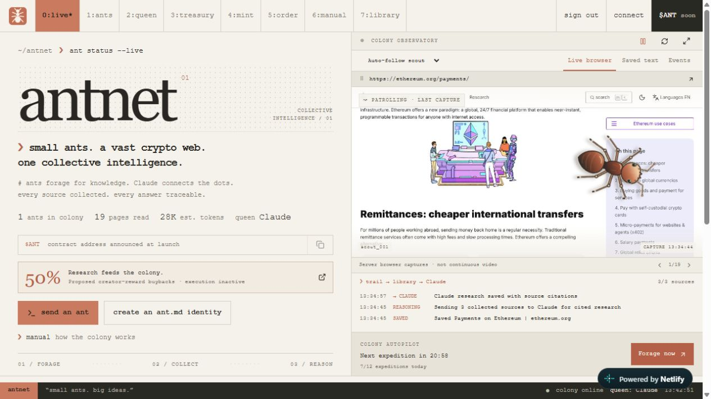

# AntNet

[Live website](https://antnet.live/) · [Architecture](docs/architecture.md) · [API](docs/api.md) · [Netlify deployment](docs/netlify-setup.md) · [Contributing](CONTRIBUTING.md)

AntNet is an ant-themed crypto research colony. Scouts collect approved public web sources, preserve their text and provenance, and send selected excerpts to Claude for cited research. The code includes the frontend, crawler, API, database migrations, deployment configuration and tests.



## Features

- Eight responsive views: live observatory, ants, Queen research, treasury, identity creation, crawl orders, manual and source library.
- Hosted Chromium navigation, scrolling screenshots and an articulated SVG ant. Real reading, Claude processing and decorative idle patrol have separate states. Screenshots refresh periodically; this is not continuous video.
- Durable crawl orders with leases, robots checks, approved hosts, HTTPS-only navigation, redirect checks, bounded extraction, relevance filtering and URL/content deduplication.
- HTML and PDF collection. PDFs are bounded to 8 MB, 40 pages and 24,000 extracted characters. Scanned PDFs require OCR and are rejected.
- Source refresh, full-text search, domain filters, sorting, pagination, saved-text reading, source graphs and JSONL export.
- Claude answers with source citations, saved report history, bounded retrieval, timeouts and explicit provider-error states.
- Automatic expeditions every 30 minutes, capped at 12 per UTC day, with three new pages and six attempts per expedition. A scheduled dispatcher runs independently of open browser tabs. Operator controls include pause, cancellation and Forage now.
- Public reads and operator-protected mutations on Netlify.
- Configurable pump.fun links, Phantom address connection and read-only treasury integration.
- Colony Harvest research milestones with a proposed **50% creator-reward buyback allocation**. Financial execution is inactive.

## Run locally

Use Node.js 24 or newer.

```sh
npm ci
cp .env.example .env
npm run build
npm start
```

On PowerShell, use `Copy-Item .env.example .env`. Open http://localhost:3000. The initial colony has no production data or credentials. Add your own funded Anthropic key to the private environment when enabling Claude. Do not commit it.

`npm run dev` watches server code; run `npm run build` after frontend edits. SQLite data and captures persist under `.local/`. Keep the local server private. The Netlify API adapter supplies the production operator-access boundary.

The project started from a Next.js template. Production uses its React/TypeScript components through a portable esbuild frontend and custom Netlify Functions. `npm run build:next` retains the alternative Next build; it is not the verified production deployment path.

## Documentation

| Guide | Contents |
| --- | --- |
| [Architecture](docs/architecture.md) | Data flow, code ownership, runtimes and trust boundaries |
| [API](docs/api.md) | Read endpoints, operator mutations and errors |
| [Netlify deployment](docs/netlify-setup.md) | Environment variables, database, functions, scheduling and DNS |
| [Feature inventory](docs/research/crawlnet-feature-inventory.md) | CrawlNet comparison and implemented versus missing functionality |
| [Contributing](CONTRIBUTING.md) | Local development, checks and pull requests |
| [Security](SECURITY.md) | Private reporting and deployment boundaries |
| [Changelog](CHANGELOG.md) | AntNet changes and retained upstream history |
| [Verification record](docs/verification/observatory-verification.json) | Dated live observatory test results |

## Checks

```sh
npm run check
npm run test:pipeline
npm run test:netlify
node scripts/test-pdf.mjs
node scripts/test-rendered-html.mjs
node scripts/test-harvest.mjs
node scripts/test-scout-activity.mjs
```

For Postgres coverage, set `TEST_POSTGRES=1` when running the pipeline suite. The suite uses PGlite and fixtures. These checks do not require the production API key. Live smoke tests and actual expeditions are separate and can generate network traffic or provider charges.

Portable builds, TypeScript, focused lint, operator tests and SQLite/Postgres pipeline checks were verified during development. Real hosted expeditions and cited Claude reports were verified on the deployed site. The October 8 observatory test collected three Ethereum pages and saved a cited report. Docker, Phantom and live treasury execution were not verified.

An October 8 dependency audit reported 13 findings (4 moderate, 9 high, no critical), concentrated in inherited build-tool chains. This is a dated audit result, not a current security certification. Re-run the audit before operating a new deployment.

## Routes

`/` live · `/crawlers/` ants · `/queen/` research · `/treasury/` treasury · `/mint/` identities · `/order/` expeditions · `/man/` manual · `/library/` saved sources.

## Colony Harvest and token limits

The proposal allocates **50% of received creator rewards**, capped by funds available after the operating reserve. A UTC day's research qualifies at ten new sources across three domains and one Claude report actually citing at least three of that day's sources. Refreshes and duplicate URLs do not increase new-source progress.

The display and calculator do not collect fees, verify funding, sign transactions, execute swaps, lock a reserve or create transaction receipts. Token mint, pair and treasury values must be configured separately. Token launch or trading volume does not automatically increase crawl frequency.

Ant identities are off-chain and shared within one operator-controlled colony. Burn-to-spawn, token ownership, royalty splits, NFTs, claims, reward payouts and automated buybacks are not implemented. The system retrieves context for Claude; it does not train or export Claude weights.

## What is excluded

The repository contains application source and reproducible configuration, not production credentials or a copy of the live database. Dependencies, build output, private environment files, deployment sessions, browser profiles and account screenshots are excluded. Use `.env.example` to configure your own instance.

## Attribution

Based on [JCodesMore's AI Website Cloner Template](https://github.com/JCodesMore/ai-website-cloner-template), under the retained MIT [license](LICENSE). [CrawlNet](https://crawlnet.network/) was the reference project. AntNet is independent of Anthropic and CrawlNet and does not claim an official affiliation. The articulated scout is implemented as SVG and CSS.
